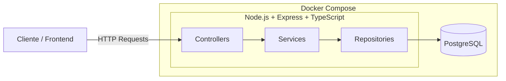
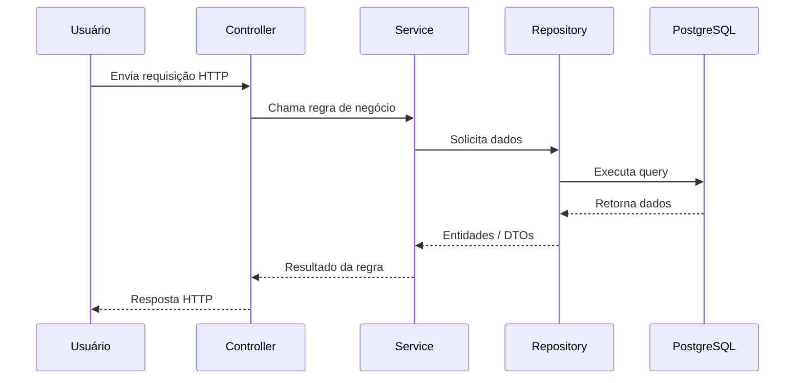

# 🛒 E-commerce Backend

Este projeto é o backend de um sistema de e-commerce, construído com **Node.js**, **TypeScript**, **Express** e **Drizzle ORM**.  
Segue o padrão **MVC** aliado à **arquitetura em camadas**, garantindo organização, manutenção e escalabilidade.  
A aplicação é containerizada com **Docker Compose** para facilitar o desenvolvimento e a execução em diferentes ambientes.

---

## 🚀 Tecnologias Utilizadas

- **Node.js** + **TypeScript**
- **Express** (framework web)
- **Drizzle ORM** (mapeamento objeto-relacional)
- **PostgreSQL** (banco de dados relacional)
- **Docker Compose** (containerização e orquestração)

---

## 📂 Estrutura do Projeto

```bash
src/
  config/        # Configurações da aplicação
  controllers/   # Camada de controllers (entrada das requisições HTTP)
  database/      # Conexão com o banco de dados
  dtos/          # Data Transfer Objects
  exceptions/    # Classes de erros personalizados
  middlewares/   # Middlewares globais e específicos
  models/        # Definições de modelos (Drizzle)
  repositories/  # Acesso e manipulação de dados
  routes/        # Definição das rotas da API
  services/      # Regras de negócio (camada de serviço)
  utils/         # Funções utilitárias
```

## 📐 Arquitetura



### 🔹 2. **Fluxo MVC + Camadas Internas**

Mostra como as camadas se conectam dentro do backend.


